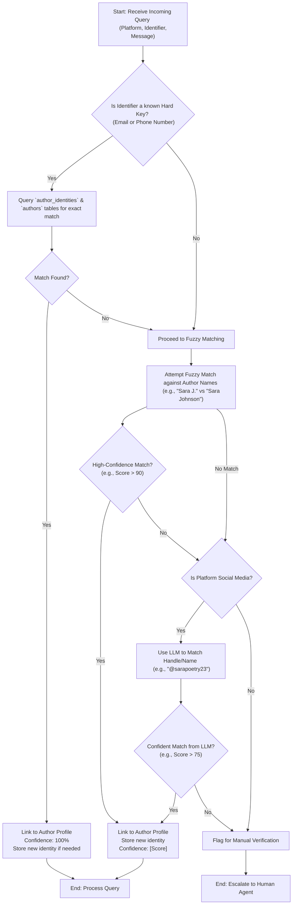

# Identity Unification System - Flowchart

This flowchart outlines the logical process for identifying an author from various platforms. The system prioritizes exact matches for speed and accuracy, falling back to fuzzy logic and LLM-based analysis for more ambiguous cases.

